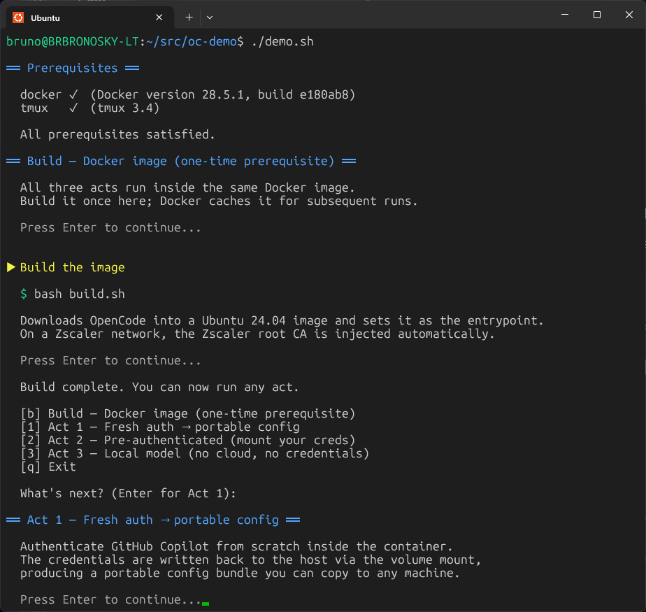

# OpenCode in Docker — Live Demo

Three acts showing how to install [OpenCode](https://opencode.ai) in a Docker
container, authenticate it with GitHub Copilot, and run it against a fully local
model — all without touching your personal OpenCode config.

## Prerequisites

- **Docker** — image build and container runtime
- **tmux** — CLI must be present on the host (Act 2 creates a session the container connects back to)

### Build the Docker image (one-time)

Build the shared image before running any act. Docker caches it — subsequent
builds are instant unless the `Dockerfile` changes.

```bash
bash build.sh
```

The image installs OpenCode and sets it as the container entrypoint.

#### Zscaler / corporate CA

If your machine is behind Zscaler or another TLS-intercepting proxy, `build.sh`
injects your root CA certificate into the image automatically. The certificate
must be present at:

```
/etc/ssl/certs/zscaler-root-ca.pem
```

> **Important:** This must be the **root CA** certificate — not an intermediate
> or leaf certificate from the chain. Installing an intermediate will cause
> partial trust failures that are difficult to diagnose. If you are unsure which
> certificate to use, ask your IT/security team for the root CA PEM specifically.

If the file is absent, `build.sh` skips the injection step and the image is
built without any extra CA trust.

---

### Demo walkthroughs

| Act | Script | Visual walkthrough |
| --- | ------ | ------------------ |
| Act 1 — Fresh auth | `bash act1/run.sh` | [act1/DEMO.md](act1/DEMO.md) |
| Act 2 — Pre-authenticated + btop | `bash act2/00-start-container.sh` | [act2/DEMO.md](act2/DEMO.md) |
| Act 3 — Local model | `bash act3/run.sh` | [act3/DEMO.md](act3/DEMO.md) |

### (Optional) Presenter guide — `demo.sh`

`demo.sh` is an interactive narrator script. It walks through prerequisites, the
build step, and each act in order — prompting before every section so you control
the pace.

```bash
bash demo.sh
```



---

## Act 1 — Fresh auth → portable config

> "I want to authenticate from scratch and end up with a config I can carry anywhere."

No pre-existing credentials. You complete the GitHub Copilot device-flow login
inside the container; `auth.json` is written back to the host through the volume
mount. The result is a portable credential bundle you can copy to any machine.

```
act1/
├── config/opencode/opencode.json        → /home/oc/.config/opencode/opencode.json
├── local/share/opencode/                → /home/oc/.local/share/opencode/  (written during login)
├── DEMO.md                              visual walkthrough with screenshots
└── run.sh
```

```bash
bash act1/run.sh
```

After the container exits, `act1/local/share/opencode/auth.json` contains your
credentials. Copy both dirs to any machine to get an instant authenticated
OpenCode install:

```bash
cp -r act1/config/opencode      ~/.config/opencode
cp -r act1/local/share/opencode ~/.local/share/opencode
```

---

## Act 2 — Pre-authenticated (mount your creds)

> "I already have GitHub Copilot credentials. How do I just bring them in?"

Two host directories are volume-mounted into the container at the paths OpenCode
expects. No login flow required inside the container. This act uses the
credentials that Act 1 produced.

```
act2/
├── config/opencode/opencode.json        → /home/oc/.config/opencode/opencode.json  (read-only)
├── local/share/opencode/auth.json       → /home/oc/.local/share/opencode/auth.json
├── prompt.md
├── 00-start-container.sh
└── 01-from-new-terminal-launch-collab-tmux-session.sh
```

### What the demo shows

OpenCode runs inside Docker with [access to the host's tmux socket](act2/00-start-container.sh#L28). It is given
a cold-start prompt — no prior knowledge of the host system or tmux state.

The goal: launch `btop` in a collaborative tmux pane. `btop` will fail with a
"terminal too small" error because the pane is too short. The [prompt](act2/prompt.md)
instructs OpenCode to notice this, resize the pane, and relaunch `btop` successfully.

### Step 1 — Start OpenCode

Run from **any terminal** (tmux or plain):

```bash
bash act2/00-start-container.sh
```

Drops you into an OpenCode session inside the container. Paste the contents of
[`act2/prompt.md`](act2/prompt.md) as your first message when instructed.

### Step 2 — Set up the tmux session with a collab pane

Run from a **plain terminal outside tmux** — this script creates the tmux
session that OpenCode will connect to. Running it from inside an existing tmux
session would nest sessions.

```bash
bash act2/01-from-new-terminal-launch-collab-tmux-session.sh
```

Creates the `oc-demo-act2` tmux session with two panes:
- [**Top pane**](act2/01-from-new-terminal-launch-collab-tmux-session.sh#L25) — shows the prompt and instructions
- [**Bottom pane**](act2/01-from-new-terminal-launch-collab-tmux-session.sh#L43) (`collab`) — OpenCode's working pane, where `btop` will run

---

## Act 3 — Local model (no cloud, no credentials)

> "No tokens leave this machine."

OpenCode runs inside the same demo container as Acts 1 and 2. Instead of GitHub
Copilot, it uses a local [Ollama](https://ollama.com) model running on the WSL
host. The container reaches Ollama via `host.docker.internal:11434`.

```
act3/
├── config/opencode/opencode.json   → /home/oc/.config/opencode/opencode.json  (read-only)
├── run.sh                          preflight checks + docker run --network=host
├── DEMO.md                         visual walkthrough with screenshots
└── PREREQS.md                      one-time Ollama + model install instructions
```

### Prerequisites (one-time)

See [`act3/PREREQS.md`](act3/PREREQS.md):

1. Install Ollama in WSL
2. Configure Ollama to bind on `0.0.0.0`: `OLLAMA_HOST=0.0.0.0 ollama serve`
3. Pull the model: `ollama pull qwen2.5-coder:1.5b`

### Run

```bash
bash act3/run.sh
```

`run.sh` verifies the image, Ollama reachability, Ollama bind address, and model
availability before launching OpenCode. Ask it anything — the entire inference
loop stays on your machine.

---

## What OpenCode reads

| Purpose                    | File path                                                                   |
| -------------------------- | --------------------------------------------------------------------------- |
| Model & config (Acts 1–2)  | `~/.config/opencode/opencode.json` (via volume mount)                      |
| GitHub Copilot auth        | `~/.local/share/opencode/auth.json` (via volume mount)                     |
| Model & config (Act 3)     | `act3/config/opencode/opencode.json` (mounted read-only)                   |
| Local model server (Act 3) | `http://host.docker.internal:11434` (Ollama on WSL host, via Docker bridge) |
