# Act 1 — Demo Walkthrough

> Fresh auth → portable config

Visual, step-by-step walkthrough for Act 1 with screenshots taken during a real
run. Use it alongside the live demo or as a rehearsal guide.

---

## Before you start

- The Docker image must be built: `bash build.sh`
- `act1/local/share/opencode/auth.json` must **not** exist — `run.sh` will warn
  you and offer to remove it if it does

---

## Step 1 — Start the container

```bash
bash act1/run.sh
```

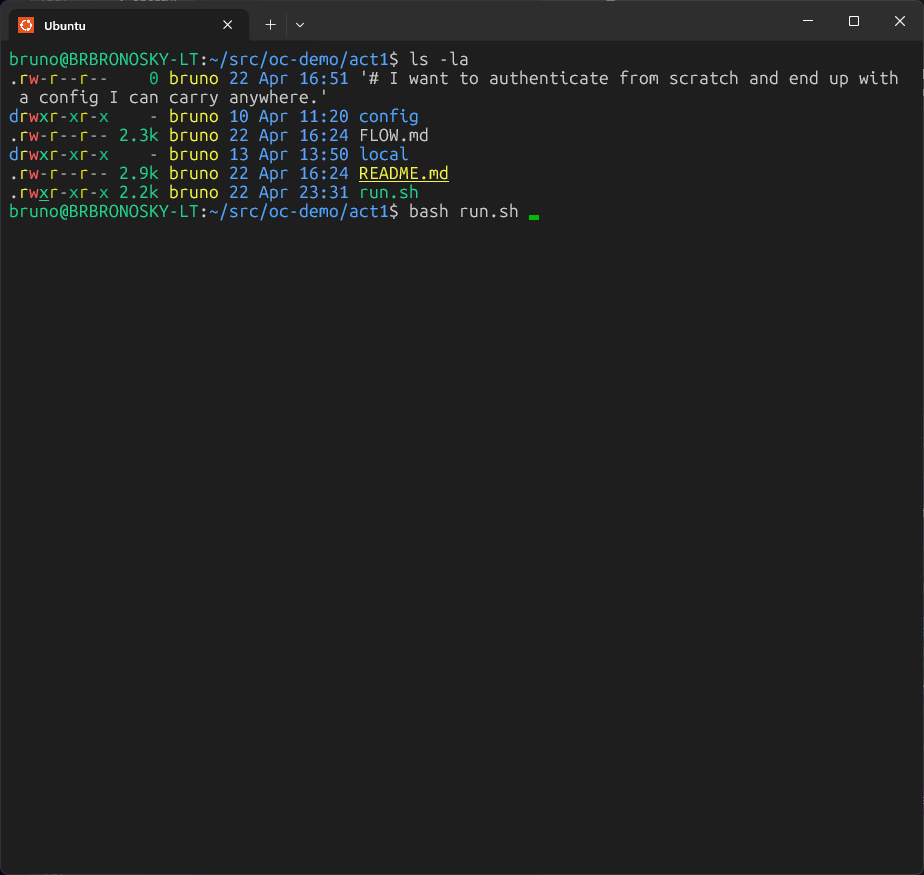

The script checks for the Docker image, ensures `local/` is owned by the
current user, and launches `docker run`. OpenCode starts inside the container.

---

## Step 2 — OpenCode splash screen

You land on the OpenCode splash screen. Notice the agent shown is **Big Pickle**
and no model is indicated in the status bar — there are no credentials yet.

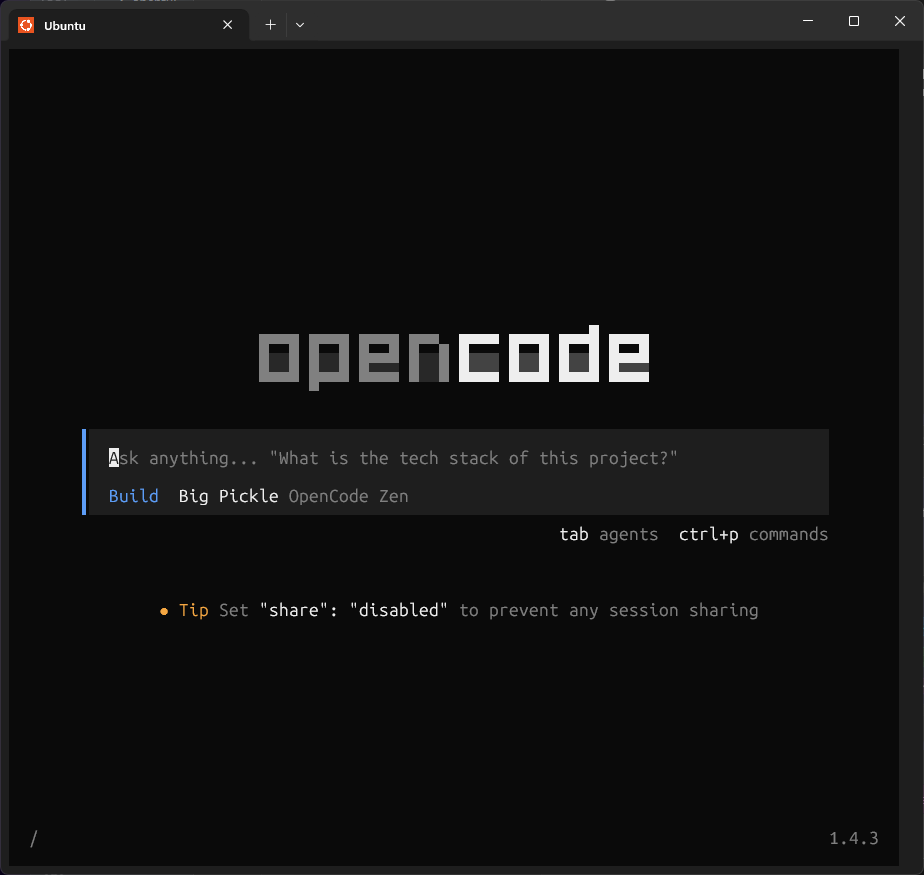

---

## Step 3 — Open the model selector

Type `/mo` — the slash-command menu appears. **`/models`** is highlighted at the
top. Press **Enter** to select it (do not submit it as a chat message).

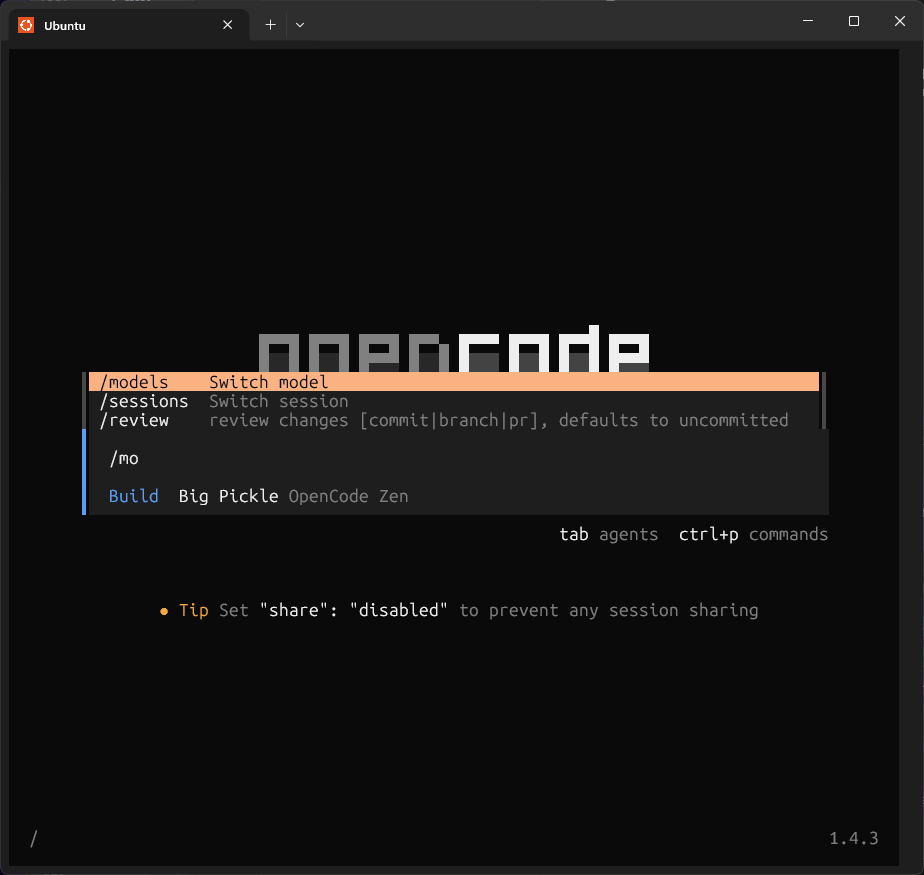

---

## Step 4 — Filter to GitHub Copilot

The **Select model** dialog opens, listing free tiers and popular providers.
Type `git` — the list filters to show **GitHub Copilot** under Popular providers.
Press **Enter** to select it.

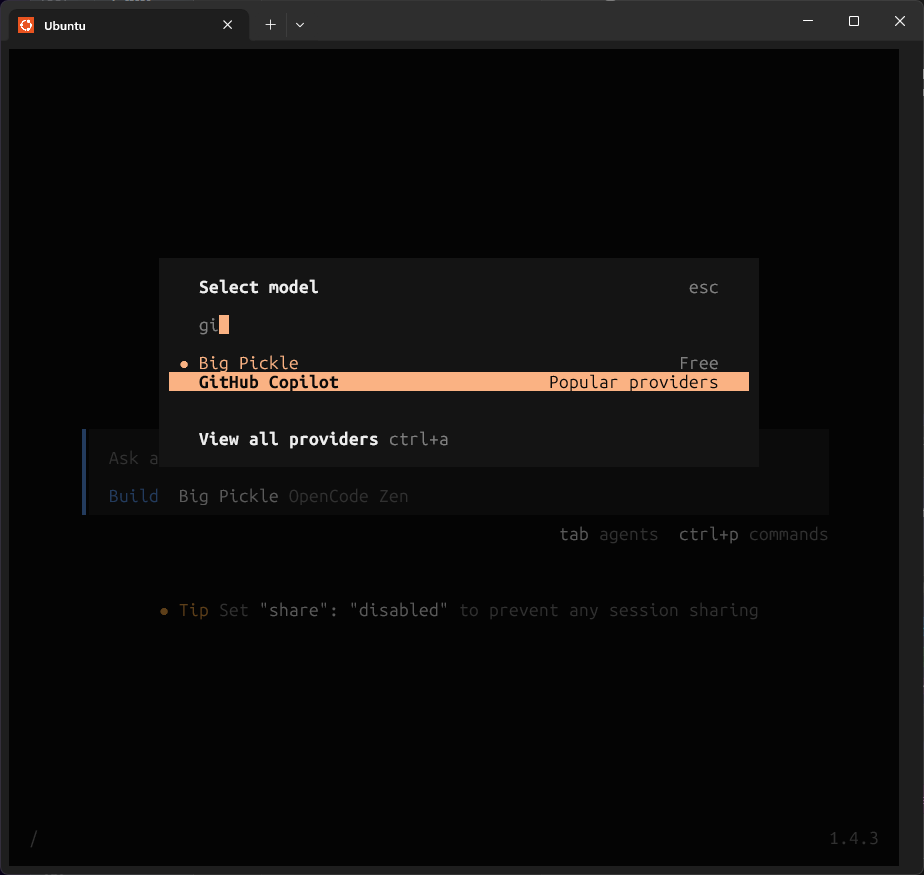

---

## Step 5 — Select deployment type

The **Select GitHub deployment type** dialog appears. **GitHub.com Public** is
pre-selected. Press **Enter** to confirm.

> Choose **GitHub Enterprise** only if you are on a self-hosted or
> data-residency GitHub instance.

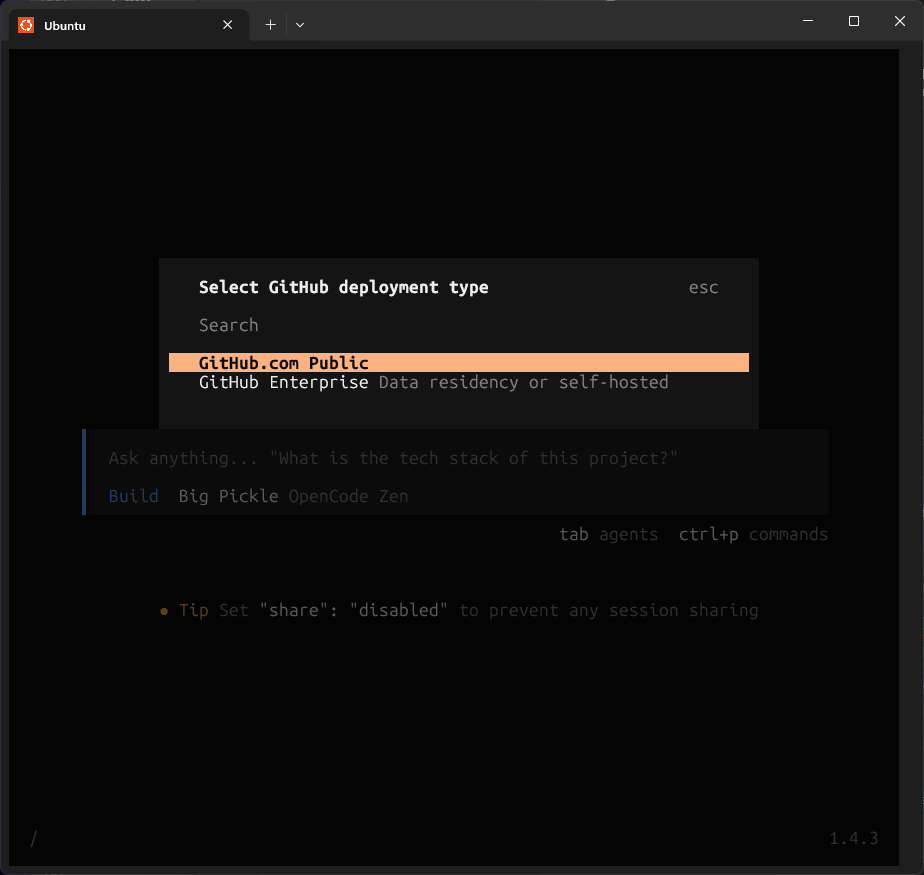

---

## Step 6 — Device-flow login

The **Login with GitHub Copilot** dialog appears showing:

- The URL: `https://github.com/login/device`
- An 8-character code (e.g. `5CFA-F399`)
- "Waiting for authorization..."

Press **`c`** to copy the code to your clipboard, then open
`https://github.com/login/device` in any browser.

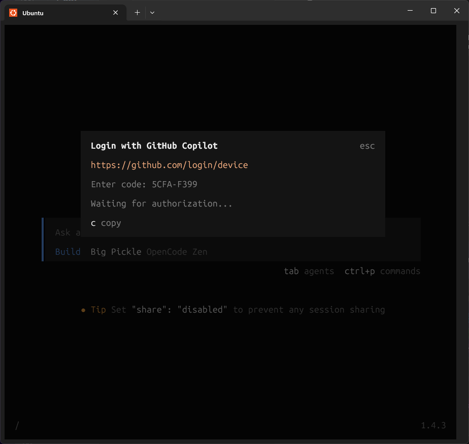

GitHub shows the **Device Activation** page. Click **Continue** to proceed with
your account.

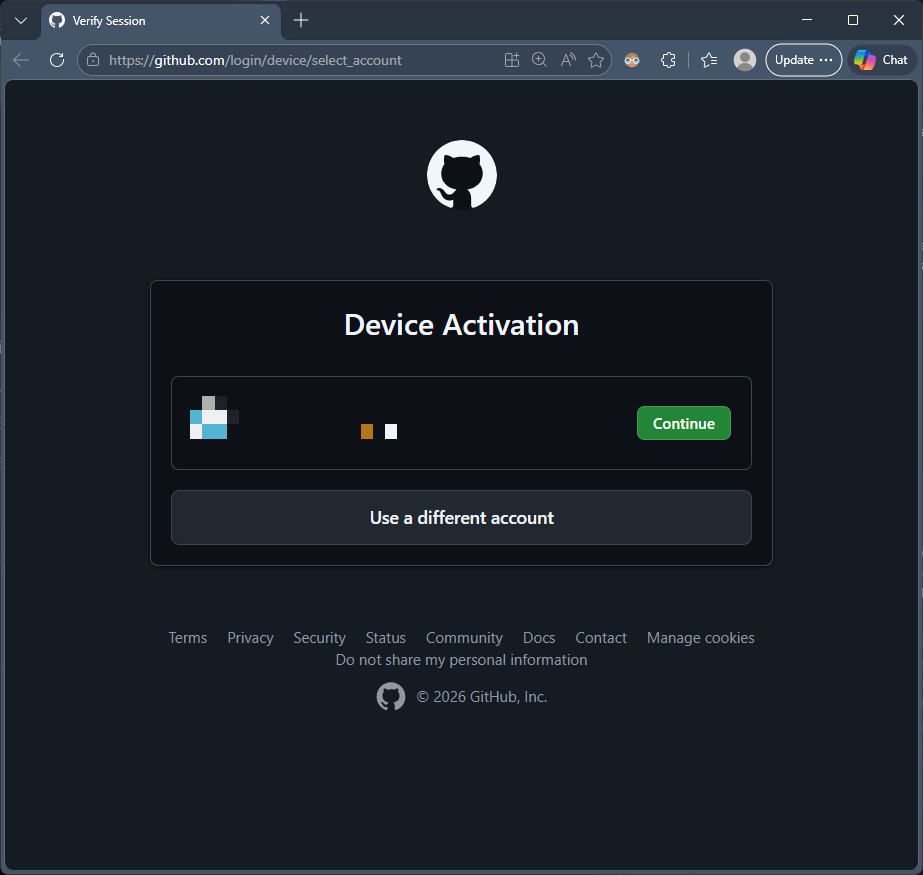

The **Authorize your device** page shows the 8-character code pre-filled.
Verify it matches what OpenCode showed, then click **Continue**.

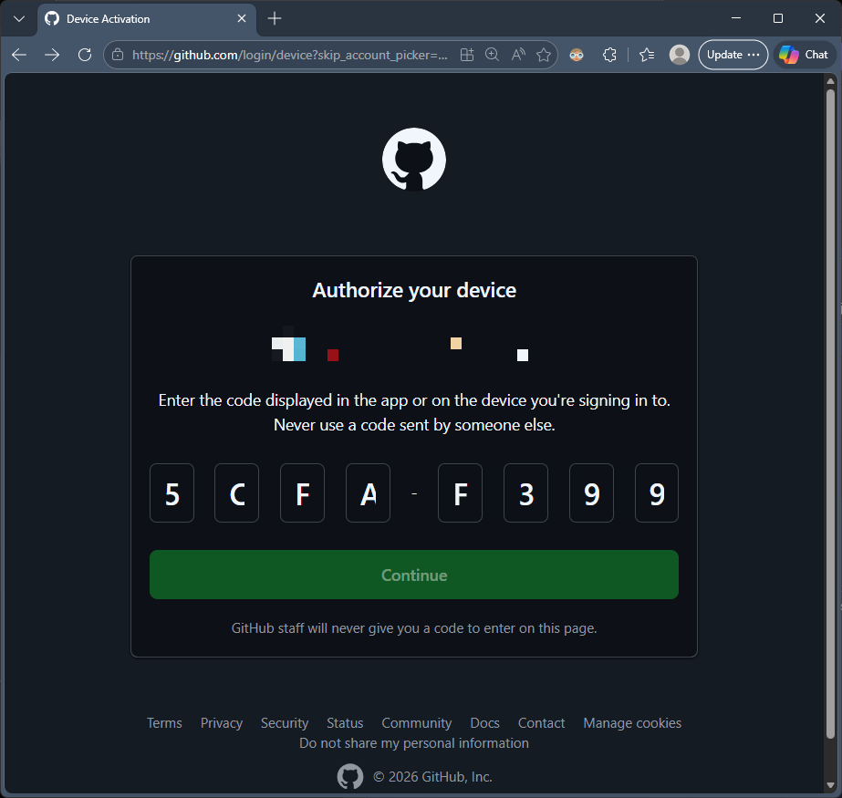

GitHub shows the **Authorize OpenCode** confirmation. This grants OpenCode by
Anomaly read access to your profile. Click **Authorize anomalyco**.

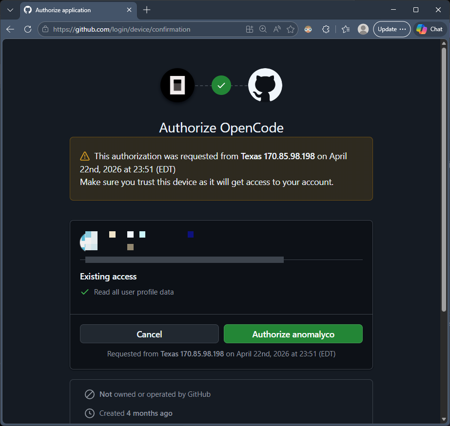

GitHub confirms: **"Congratulations, you're all set! Your device is now
connected."** Switch back to the terminal — the OpenCode dialog clears
automatically.

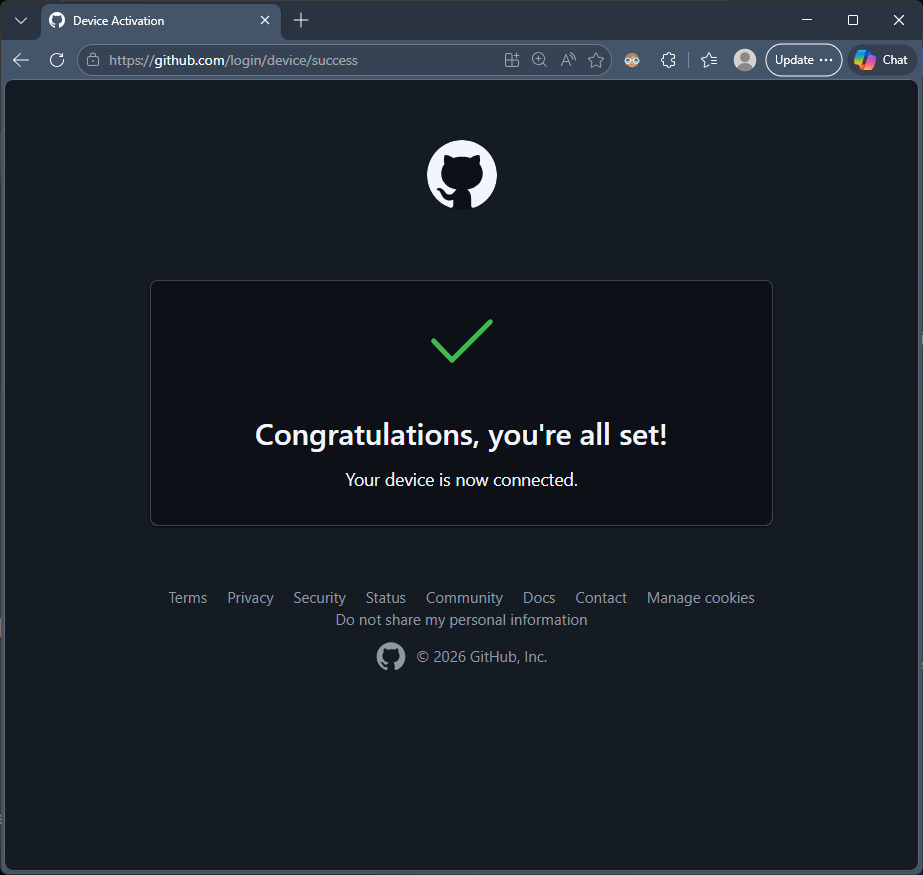

---

## Step 7 — Select the model

OpenCode returns to the **GitHub Copilot** model list. Navigate to
**Claude Sonnet 4.6** and press **Enter**. If a variant dialog appears, press
**Enter** to accept **Default**.

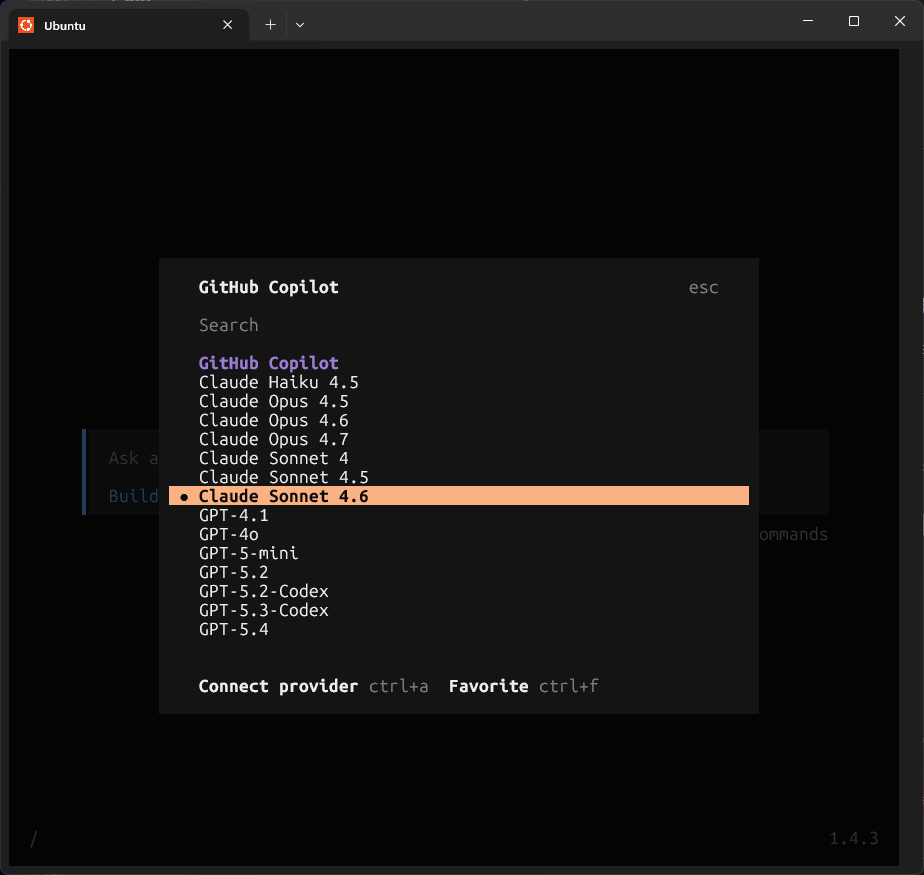

The status bar now shows `Claude Sonnet 4.6 GitHub Copilot`. Type a test prompt
and press **Enter** to confirm the model responds.

---

## Step 8 — Exit and collect credentials

Press `Escape` then `q` to quit OpenCode. `run.sh` prints the portable config
summary and exits.

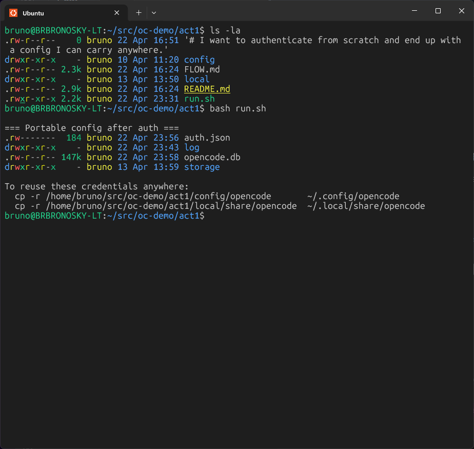

`act1/local/share/opencode/auth.json` now exists on the host. Copy both
directories to any machine for an instant authenticated OpenCode install:

```bash
cp -r act1/config/opencode      ~/.config/opencode
cp -r act1/local/share/opencode ~/.local/share/opencode
```

---

← [README](../README.md) · **Act 1** · [Act 2 →](../act2/DEMO.md)
