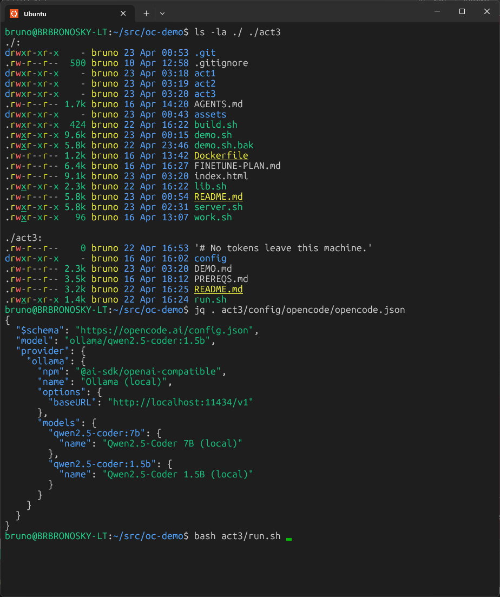
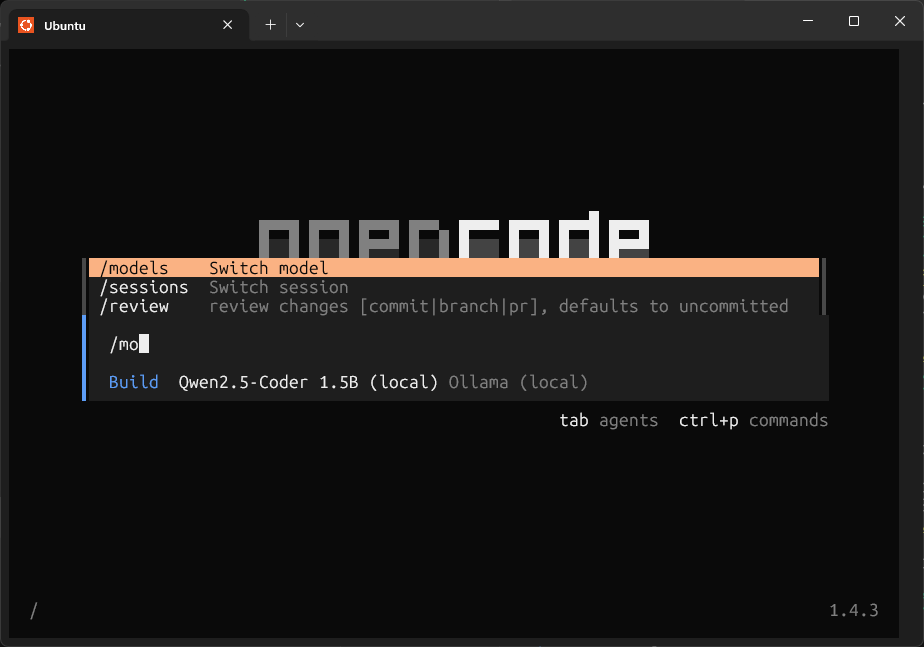
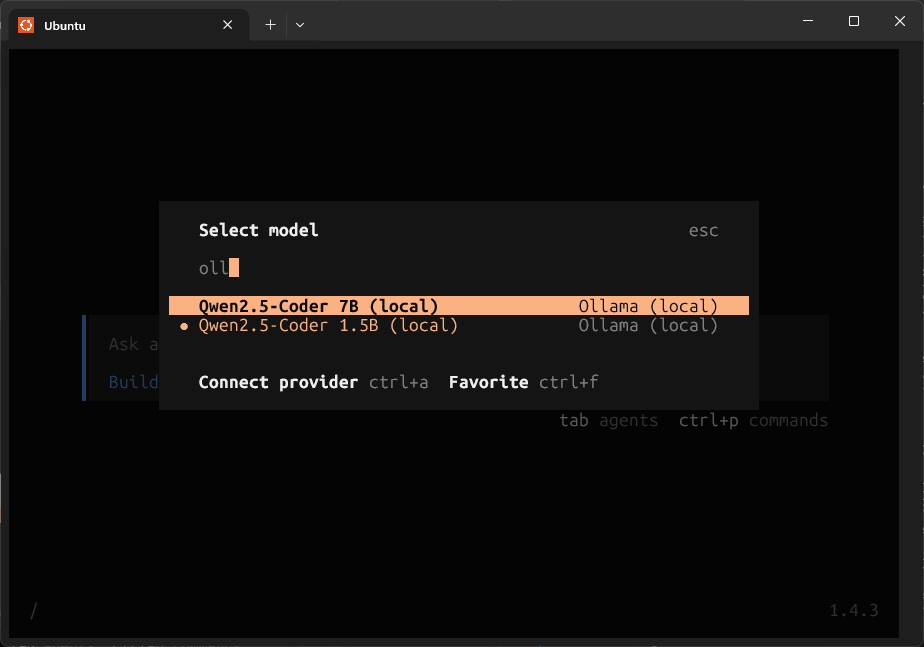
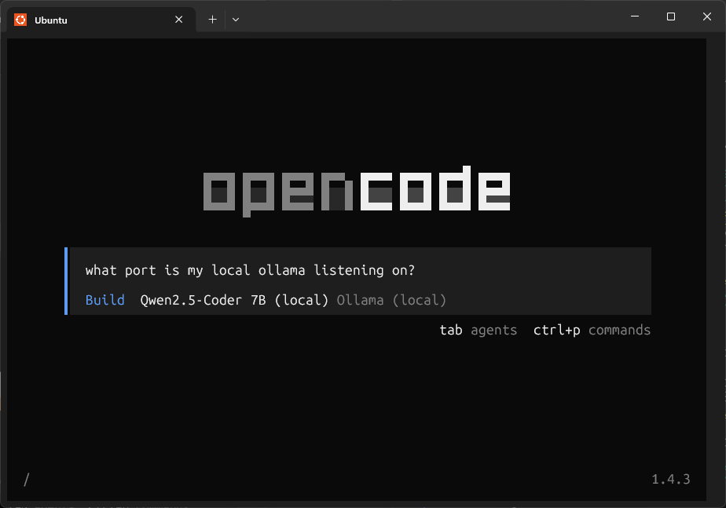

# Act 3 — Demo Walkthrough

> Local model — no cloud, no credentials

Visual, step-by-step walkthrough for Act 3 with screenshots taken during a real
run. Use it alongside the live demo or as a rehearsal guide.

---

## Before you start

- The Docker image must be built: `bash build.sh`
- Ollama must be installed, running, and bound to `0.0.0.0`:
  `OLLAMA_HOST=0.0.0.0 ollama serve`
- The model must be pulled: `ollama pull qwen2.5-coder:1.5b`
- See [`act3/PREREQS.md`](PREREQS.md) for the one-time setup guide

---

## Step 1 — Inspect the config and start the container

The magic is in [`act3/config/opencode/opencode.json`](config/opencode/opencode.json).
It registers Ollama as a custom OpenAI-compatible provider and sets the active
model — no cloud provider, no API key. Worth showing to the audience before
launching.

```bash
jq . act3/config/opencode/opencode.json
bash act3/run.sh
```



`run.sh` checks that the image, Ollama, and model are all present before
launching the container.

---

## Step 2 — OpenCode splash screen

OpenCode launches already configured for local inference. The status bar shows
**`Qwen2.5-Coder 1.5B (local)  Ollama (local)`** — no GitHub Copilot, no token.


---

## Step 3 — Switch to the 7B model

Type `/mo` — the slash-command menu appears with **`/models`** highlighted.
Press **Enter** to open the model selector.



Type `oll` to filter. Both registered models appear — **Qwen2.5-Coder 7B** and
**1.5B**, both under **Ollama (local)**. Navigate to 7B and press **Enter**.

> The dot (·) next to 1.5B indicates it is the current active model.
> Requires `ollama pull qwen2.5-coder:7b` (~4 GB) if not already pulled.



---

## Step 4 — Send a prompt

The status bar now shows **Qwen2.5-Coder 7B (local)**. Type any prompt and
press **Enter** — inference runs entirely on the host via Ollama.



---

← [Act 2](../act2/DEMO.md) · **Act 3** · [README](../README.md)
